# Mermaid Diagram Examples for VeoJava YouTube Script

## Video Generation Flow

## Polling Strategy Decision Tree

## Thread Usage Comparison

## Reactive Streams Flow

## Performance Scaling Visualization

## API Architecture Overview

## Code Complexity Comparison

```mermaid
graph LR
    subgraph "Lines of Code"
        A[Busy Wait: 5] --> B[Virtual Threads: 10]
        B --> C[Reactive: 15]
        C --> D[ScheduledExecutor: 30]
    end
    
    subgraph "Cognitive Load"
        E[😊 Low] -.-> A
        E -.-> B
        F[🤔 Medium] -.-> D
        G[😰 High] -.-> C
    end
```

