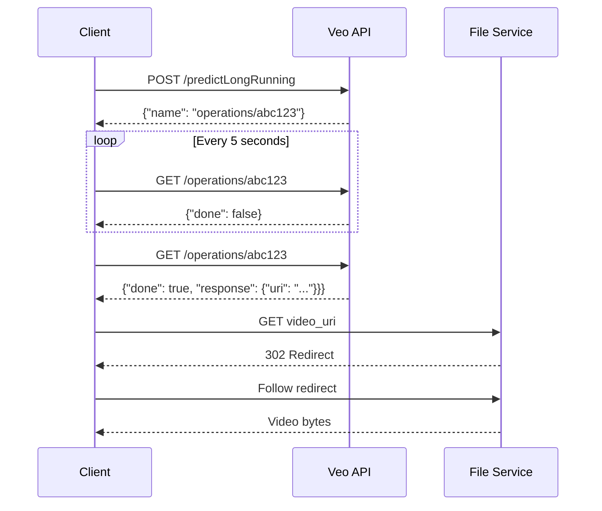

# Java Text-to-Video Generation: Solving the Polling Problem with Google's Veo 3 API

**Target Length:** 10–12 minutes  
**Audience:** Java developers interested in AI/ML integration  
**Format:** Tutorial with live coding demonstrations

---

## Opening Hook (0:00–0:20)

[SCREEN: VS Code with empty file, cursor blinking]

**"What if I told you that generating a video from text in Java is not just possible, but could cost you six dollars and take four minutes every single time you press run?"**

[Cut to screen recording showing a simple API call]

**"Google's new Veo 3 API can create stunning 8-second videos from just a text prompt. But here's the catch—it's not a simple request-response. The API immediately returns an operation ID, then you have to poll for completion. And if you do it wrong, you'll burn through your CPU and your budget."**

[Show polling loop going crazy on screen]

**"Today I'm going to show you five different Java approaches to solve this polling problem, from a simple blocking approach that works great for single requests, to elegant concurrent solutions using Spring WebFlux, virtual threads, and more. By the end, you'll know exactly which approach to use for your specific use case."**

---

## Problem Introduction (0:20–2:00)

[SCREEN: Switch to presentation slide showing API flow diagram]

**"Let's start with understanding what we're working with. Google's Veo 3 is a text-to-video generation model that creates 720p videos at 24 fps. With the fast preview model, each 8-second video costs about $3.20—compared to $6 for the standard model—so we want to get this implementation correct the first time."**

[Show Mermaid diagram of the API flow]



**"The process is straightforward but has some gotchas. First, you submit your prompt and get an operation ID immediately. Then you need to poll that operation until it's complete—which typically takes 2 to 4 minutes. Finally, you download the video file, but here's a critical detail most tutorials miss—the download URL returns a 302 redirect that you must handle properly."**

[SCREEN: Show actual API response JSON]

```json
{
  "name": "models/veo-3.0-fast-generate-preview/operations/abc123",
  "done": true,
  "response": {
    "generateVideoResponse": {
      "generatedSamples": [{
        "video": {
          "uri": "https://generativelanguage.googleapis.com/download/v1/..."
        }
      }]
    }
  }
}
```

**"Now, let's start with the most straightforward approach - a simple while loop with sleep. This is perfectly reasonable for single-use scripts or one-off requests. In fact, this is exactly what Google's official documentation recommends at ai.google.dev/gemini-api/docs/video. Here's their Python example:"**

[SCREEN: Show Google's Python documentation at ai.google.dev]

```python
import time
from google import genai

client = genai.Client()
operation = client.models.generate_videos(
    model="veo-3.0-fast-generate-preview", 
    prompt=prompt
)

# Poll the operation status until the video is ready
while not operation.done:
    print("Waiting for video generation to complete...")
    time.sleep(10)
    operation = client.operations.get(operation)

# Download the generated video
generated_video = operation.response.generated_videos[0]
client.files.download(file=generated_video.video)
```

**"This is clean, simple, and perfect for what it does. Google also provides examples in other languages on the same documentation page, including this REST/curl version:"**

[SCREEN: Show Google's REST documentation section]

```bash
# Send request and capture operation name
operation_name=$(curl -s "${BASE_URL}/models/veo-3.0-generate-preview:predictLongRunning" \
  -H "x-goog-api-key: $GEMINI_API_KEY" \
  -X "POST" -d '{"instances": [{"prompt": "..."}]}' | jq -r .name)

# Poll until ready
while true; do
  status_response=$(curl -s -H "x-goog-api-key: $GEMINI_API_KEY" "${BASE_URL}/${operation_name}")
  is_done=$(echo "${status_response}" | jq .done)
  
  if [ "${is_done}" = "true" ]; then
    video_uri=$(echo "${status_response}" | jq -r '.response.generateVideoResponse.generatedSamples[0].video.uri')
    curl -L -o video.mp4 -H "x-goog-api-key: $GEMINI_API_KEY" "${video_uri}"
    break
  fi
  sleep 10
done
```

**"Notice they're using the same exact pattern: submit, poll with sleep, download. This is the canonical approach across all languages. Now, normally the advantage of using Google's client libraries in Python or JavaScript is that they handle all the JSON mapping for you. But in this case, the request and response structures are quite simple, so Java records give us the same benefit. The real difference—and where Java shines—is in how we handle the networking and concurrency when we translate this pattern to web applications."**

---

## The Simple Blocking Approach (2:00–3:30)

[SCREEN: VS Code showing blocking polling code]

**"Here's the most straightforward approach - exactly what you'd write in Python, Go, or any other language:"**

```java
// Simple and clear - perfect for one-off requests
public VideoResult generateVideoBlocking(String prompt) {
    VideoGenerationResponse response = submitRequest(prompt);
    String operationId = response.operationId();
    
    OperationStatus status;
    do {
        Thread.sleep(5000); // Blocks this thread
        status = checkStatus(operationId);
    } while (!status.done());
    
    return downloadVideo(operationId);
}
```

**"This approach is beautifully simple and completely appropriate for standalone scripts, CLI tools, or one-off requests. The problem arises when you're building a web service in Java. You're blocking an OS thread from your web server's thread pool. If you have a default Tomcat configuration with 200 threads, and 50 users try to generate videos simultaneously, you've consumed 25% of your thread pool for 4 minutes each. Your application will become unresponsive to new requests."**

[SCREEN: Show thread pool monitoring with threads stuck]

**"Plus, this approach doesn't handle timeouts, cancellation, or error recovery gracefully. The real power of Java shines when you need to handle multiple concurrent requests efficiently. Let me show you five different approaches that leverage Java's concurrency strengths."**

---

## Solution 1: HttpClient with CompletableFuture (3:30–5:00)

[SCREEN: Open VeoJava project in IDE]

**"Let's start with pure Java—no Spring dependencies. This approach uses the built-in HttpClient with CompletableFuture for async handling."**

[Show HttpClientVeoVideoClient.java]

```java
public CompletableFuture<VideoResult> generateVideoAsync(VideoGenerationRequest request) {
    return CompletableFuture
        .supplyAsync(() -> submitVideoGeneration(request))
        .thenCompose(response -> pollForCompletion(response.operationId()))
        .thenApply(this::downloadVideo);
}

private CompletableFuture<String> pollForCompletion(String operationId) {
    return CompletableFuture.supplyAsync(() -> {
        OperationStatus status;
        do {
            try {
                Thread.sleep(5000);
                status = checkOperationStatus(operationId);
            } catch (InterruptedException e) {
                Thread.currentThread().interrupt();
                throw new RuntimeException(e);
            }
        } while (!status.done());
        return operationId;
    });
}
```

**"This approach moves the blocking to a separate thread pool, which is better for web applications since it doesn't tie up your main request-handling threads. We're still blocking threads, but at least they're dedicated worker threads. The key improvement here is the HttpClient configuration for handling redirects:"**

```java
private final HttpClient httpClient = HttpClient.newBuilder()
    .followRedirects(HttpClient.Redirect.NORMAL)
    .connectTimeout(Duration.ofSeconds(30))
    .build();
```

**"The redirect handling is crucial because Google's file service returns a 302 redirect to the actual video content. Most developers miss this and wonder why their downloads fail."**

---

## Solution 2: Spring RestClient (5:00 - 6:00)

[SCREEN: Show RestClientVeoVideoClient.java]

**"If you're using Spring Boot, RestClient provides a cleaner API with excellent redirect handling out of the box:"**

```java
@Component
public class RestClientVeoVideoClient implements VeoVideoClient {
    
    private final RestClient restClient;
    
    public RestClientVeoVideoClient() {
        this.restClient = RestClient.builder()
            .baseUrl("https://generativelanguage.googleapis.com/v1beta")
            .defaultHeader("x-goog-api-key", apiKey)
            .requestFactory(clientHttpRequestFactory())
            .build();
    }
    
    @Override
    public VideoResult downloadVideo(String operationId) {
        // RestClient handles redirects automatically
        byte[] videoBytes = restClient.get()
            .uri("/operations/" + operationId)
            .retrieve()
            .body(byte[].class);
            
        return new VideoResult(/* ... */);
    }
}
```

**"RestClient is Spring's modern replacement for RestTemplate, and it handles the redirect issue elegantly with proper request factory configuration. But we still haven't unlocked Java's full concurrency potential—we're still blocking threads when we could be doing so much more."**

---

## Solution 3: ScheduledExecutorService Strategies (6:00 - 7:30)

[SCREEN: Show SelfSchedulingPollingStrategy.java]

**"This is where Java really starts to shine for concurrent applications. Instead of blocking threads, we use ScheduledExecutorService to handle the polling asynchronously. This lets us handle hundreds of video requests concurrently with just a few threads. I've implemented two variants:"**

**"First, the self-scheduling approach:"**

```java
private CompletableFuture<String> pollForCompletion(VeoVideoClient client, String operationId) {
    CompletableFuture<String> future = new CompletableFuture<>();
    
    Runnable pollTask = new Runnable() {
        @Override
        public void run() {
            try {
                OperationStatus status = client.checkOperationStatus(operationId);
                
                if (status.done()) {
                    future.complete(operationId);
                } else {
                    scheduler.schedule(this, 5, TimeUnit.SECONDS);
                }
            } catch (Exception e) {
                future.completeExceptionally(e);
            }
        }
    };
    
    scheduler.schedule(pollTask, 0, TimeUnit.SECONDS);
    return future.orTimeout(10, TimeUnit.MINUTES);
}
```

**"This approach reschedules itself after each check, which gives you dynamic timing control. You could implement exponential backoff or adjust the interval based on load."**

[SCREEN: Show FixedRatePollingStrategy.java]

**"The fixed-rate approach is simpler and more predictable:"**

```java
private CompletableFuture<String> pollForCompletion(VeoVideoClient client, String operationId) {
    CompletableFuture<String> future = new CompletableFuture<>();
    
    ScheduledFuture<?> scheduledTask = scheduler.scheduleAtFixedRate(() -> {
        try {
            OperationStatus status = client.checkOperationStatus(operationId);
            if (status.done()) {
                future.complete(operationId);
            }
        } catch (Exception e) {
            future.completeExceptionally(e);
        }
    }, 0, 5, TimeUnit.SECONDS);
    
    future.whenComplete((result, throwable) -> scheduledTask.cancel(false));
    return future.orTimeout(10, TimeUnit.MINUTES);
}
```

**"Both approaches are non-blocking and resource-efficient. You can handle hundreds of concurrent video generation requests without exhausting your thread pool."**

---

## Solution 4: Reactive with Spring WebFlux (7:30 - 9:00)

[SCREEN: Show ReactiveVeoVideoClient.java]

**"Now for the most common asynchronous approach—reactive streams using Spring WebFlux. This gives you the most elegant solution with built-in backpressure handling:"**

```java
public Mono<VideoResult> generateVideoReactive(VideoGenerationRequest request) {
    return submitVideoGeneration(request)
            .flatMap(response -> pollUntilComplete(response.operationId()))
            .flatMap(this::downloadVideo);
}

private Mono<String> pollUntilComplete(String operationId) {
    return Flux.interval(Duration.ZERO, Duration.ofSeconds(5))
            .flatMap(_ -> checkOperationStatus(operationId))
            .filter(OperationStatus::done)
            .next()
            .handle((status, sink) -> {
                if (status.error() != null) {
                    sink.error(new RuntimeException("Video generation failed"));
                } else {
                    sink.next(operationId);
                }
            })
            .timeout(Duration.ofMinutes(10));
}
```

**"This approach is beautiful because it expresses the polling logic declaratively. Flux.interval creates a time-based stream, we map each tick to a status check, filter for completion, and take the first result. The entire chain is non-blocking and composable."**

[SCREEN: Show WebClient configuration]

```java
public ReactiveVeoVideoClient(@Value("${gemini.api.key}") String apiKey) {
    HttpClient httpClient = HttpClient.create().followRedirect(true);
    ReactorClientHttpConnector connector = new ReactorClientHttpConnector(httpClient);
    
    this.webClient = WebClient.builder()
            .baseUrl(BASE_URL)
            .clientConnector(connector)
            .codecs(configurer -> configurer.defaultCodecs().maxInMemorySize(2 * 1024 * 1024))
            .defaultHeader("x-goog-api-key", apiKey)
            .build();
}
```

**"Notice the 2MB buffer configuration—the default WebClient buffer is only 256KB, but Veo videos are around 635KB, so you need to increase this or your downloads will fail."**

---

## Solution 5: Virtual Threads (9:00–10:00)

[SCREEN: Show VirtualThreadPollingStrategy.java]

**"Finally, let's look at the Java 21+ solution - virtual threads. This gives you the simplicity of blocking code with the performance of async processing:"**

```java
@Override
public CompletableFuture<VideoResult> generateVideo(VeoVideoClient client, VideoGenerationRequest request) {
    return CompletableFuture.supplyAsync(() -> {
        try {
            VideoGenerationResponse response = client.submitVideoGeneration(request);
            String operationId = response.operationId();
            
            OperationStatus status;
            do {
                Thread.sleep(Duration.ofSeconds(5));
                status = client.checkOperationStatus(operationId);
            } while (!status.done());
            
            return client.downloadVideo(operationId);
            
        } catch (InterruptedException e) {
            Thread.currentThread().interrupt();
            throw new RuntimeException("Interrupted", e);
        }
    }, virtualExecutor);
}

private static final ExecutorService virtualExecutor = 
    Executors.newVirtualThreadPerTaskExecutor();
```

**"This looks like the naive approach, but it's running on virtual threads. Virtual threads are so lightweight that you can have millions of them, so blocking is no longer a concern. This is arguably the clearest and most maintainable solution if you're on Java 21 or later."**

---

## Performance Comparison & Recommendations (10:00 - 11:30)

[SCREEN: Comparison table]

| Approach          | Java Version | Complexity | Resource Usage         | Debugging | Best For         |
|-------------------|--------------|------------|------------------------|-----------|------------------|
| HttpClient        | 11+          | Medium     | High (thread blocking) | Easy      | Simple cases     |
| RestClient        | Spring 6+    | Low        | High (thread blocking) | Easy      | Spring apps      |
| ScheduledExecutor | 8+           | High       | Low                    | Medium    | Enterprise apps  |
| Reactive          | Spring 5+    | High       | Very Low               | Hard      | High-concurrency |
| Virtual Threads   | 21+          | Low        | Very Low               | Easy      | Modern Java apps |

**"Here are my recommendations:**

**"For new projects on Java 21+, use virtual threads. The code is simple, performant, and easy to debug."**

**"For high-concurrency applications, especially if you're already using Spring WebFlux, go reactive. The learning curve is steep, but the performance and composability are unmatched."**

**"For traditional Spring Boot applications, use the ScheduledExecutorService approaches. They give you the best balance of performance and maintainability on older Java versions."**

**"Avoid blocking approaches in high-concurrency web applications—they'll limit your scalability, but remember they're perfectly fine for standalone tools or single-request scenarios."**

[SCREEN: Show demo running with performance metrics]

**"I've tested all these approaches with multiple concurrent requests, and the virtual thread and reactive solutions consistently handle 100+ concurrent video generations without breaking a sweat, while the blocking approaches start failing around 20–30 concurrent requests."**

---

## Gotchas and Production Tips (11:30–12:00)

[SCREEN: Code showing error handling]

**"Before we wrap up, here are the key gotchas that will save you hours of debugging:"**

**"First, always handle 302 redirects in your HTTP client configuration. Google's file service requires this."**

**"Second, increase buffer sizes for WebClient—videos are larger than default limits."**

**"Third, implement proper timeouts. Video generation can take up to 5 minutes, so set your timeouts accordingly."**

**"Fourth, implement proper resource cleanup with @PreDestroy methods for any ScheduledExecutorService instances to prevent memory leaks when your Spring application shuts down."**

**"Fifth, remember the cost—each video costs about 6 dollars. Implement rate limiting and user quotas."**

**"Finally, the API has content filters. Generic prompts work better than specific celebrity or brand references."**

---

## Closing & Call to Action (12:00–12:30)

[SCREEN: GitHub repository]

**"The complete code for all five approaches is available in my VeoJava repository on GitHub. The link is in the description, along with setup instructions and integration tests (disabled by default to prevent accidental costs—enable manually if you want to test with real API calls for 6 dollars each)!"**

**"Which approach will you use in your projects? Let me know in the comments. If you found this helpful, subscribe for more Java AI integration tutorials, and if you want to see a specific AI API integration, drop a suggestion below."**

**"Next week, I'm covering Spring AI's new vector database integrations, so make sure you're subscribed. Thanks for watching, and I'll see you in the next one!"**

---

## Video Metadata

### Suggested Titles (A/B Test):
1. "Java Text-to-Video: 5 Ways to Poll Google's Veo 3 API (Without Breaking Your Server)"
2. "Stop Blocking Threads! Better Java Patterns for AI API Polling"
3. "Google Veo 3 + Java: From Naive Loops to Virtual Threads"

### Thumbnail Concept:
- Split screen: Left showing blocking threads (red), right showing async solutions (green)
- Java logo + Google Veo logo
- Text overlay: "5 Polling Strategies"

### Key Timestamps:
- 0:00 Hook & Problem Introduction
- 2:00 The Simple Blocking Approach
- 3:30 HttpClient + CompletableFuture
- 5:00 Spring RestClient
- 6:00 ScheduledExecutorService Strategies
- 7:30 Reactive with WebFlux
- 9:00 Virtual Threads (Java 21+)
- 10:00 Performance Comparison
- 11:30 Production Gotchas

### SEO Description:
Learn 5 different Java approaches for integrating with Google's Veo 3 text-to-video API, from basic HttpClient to advanced reactive patterns with Spring WebFlux and virtual threads. Based on Google's official documentation at ai.google.dev, includes complete code examples, performance comparisons, and production gotchas. Perfect for Java developers working with AI APIs.

### Tags:
java, AI, google-veo, text-to-video, spring-boot, webflux, virtual-threads, completablefuture, reactive-programming, api-integration, polling-strategies, async-programming

### Equipment Needed:
- Screen recording software
- IDE with VeoJava project
- Valid Google AI API key for demos
- Presentation slides for diagrams

### B-Roll Suggestions:
- Code scrolling through different implementations
- Terminal showing successful video generation
- Performance monitoring dashboard
- Generated video samples (if content appropriate)